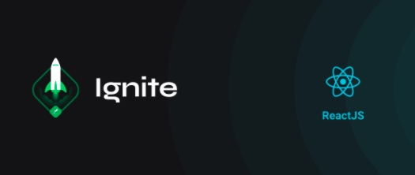

# Rocketseat Ignite Bootcamp


<br/>

## Challenge 02 - React Components
<br/>
The challenge was to break the application contained in App.tsx into small components

<ul>
   <li>Cut code from the App component to paste it into another component and make the proper tweakings</li>
   <li>Connect the given interfaces to the new components to eradicate the errors</li>
   <li>Analyze which parts of code and data needed to be passed to the other components and make it work</li>
</ul>

This is what it looks like:


# Instalação

Depois de fazer o download você deverá instalar as dependências utilizando gerenciadores de pacotes. 

usando NPM: 

```sh
npm install
```
usando Yarn
```sh
yarn
```

# Setup

There are two commands to be run in the terminal:
<br/><br/>

#### Start the backend server in order to display the content fetched from the API

```sh
yarn server
```
or
```sh
npm run server
```
#### Start the React Application in the frontend
<br/>

```sh
yarn dev
```
or
```sh
npm run dev
```

# License
© Projeto feito pela [Rocketseat](https://www.linkedin.com/school/rocketseat/) e o desafio feito por [Ramon Pereira](https://www.linkedin.com/in/ramon-pereira88/) 🤝
